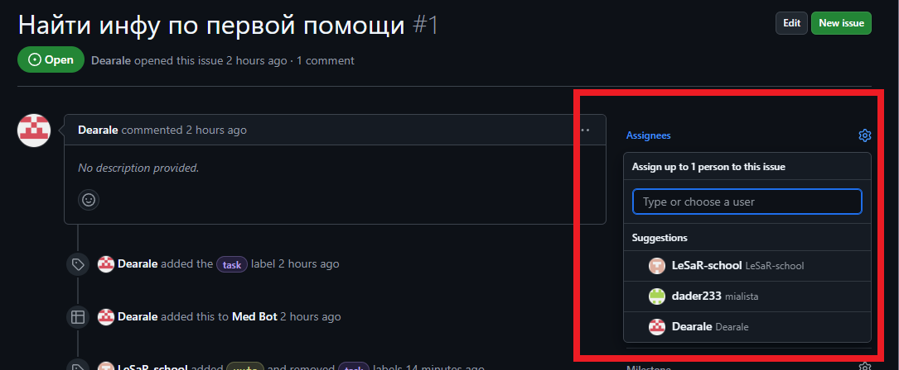
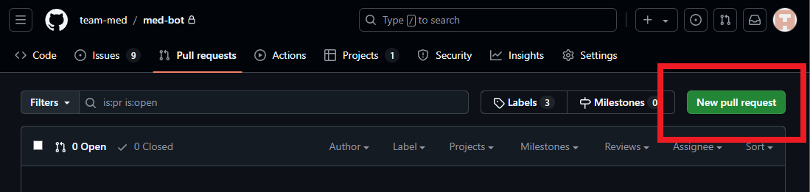

# Процесс разработки

## git flow

Когда появляется новая проблема (issue) на github, и ты хочешь ей заняться, проделай следующие шаги:

-   Добавь себя как "assignee"
    
    Если там уже есть человек, ты опоздал :(
-   Создай ветку с названием `feature/название фичи` от ветви `develop`
    Это можно сделать коммандой `git checkout -b feature/name develop`
-   Пишешь код
-   Когда фича полностью готова, создай `pull request` в github
    
-   Я (Илья) одобрю его или отправлю его на доработку

# МедБот

## 1. Инфа по первой помощи

Дает информацию по действиям в критических ситуациях: остановка сердца, удушья и т.д.

## 2. Мед календарь, напоминания

Помогает пользователям не забывать о важных медицинских обследованиях, вакцинациях и приемах. Боту можно добавить систему напоминаний. Он будет напоминать о плановых медобследованиях, таких как профессиональная дентальная чистка раз в полгода, медицинские осмотры раз в год. В него можно вписать курс лечения, который проходит пользователь, и бот будет напоминать о приеме в течение дня.

## 3. Советы по ментальному здоровью, ЗОЖ, напоминания по питанию, прогулке, сну, количеству шагов, экологии

Персональные рекомендации в зависимости от возраста, роста, веса.

Раздел с советами по психическому здоровью, техниками релаксации, медитации, управления стрессом и тревогой. Возможность получить советы о том, как бороться с эмоциональным выгоранием или депрессией.

Рекомендации по профилактике распространенных заболеваний, основанные на сезоне или других факторах (например, как избежать простуды зимой, как защититься от солнца летом).

Здесь также можно оставить ссылки на статьи, исследования, YouTube-каналы и т.д.

## 4. Мед библиотека

Продвинутый раздел с информацией по симптомам заболеваний, методам лечения, диетам и упражнениям.

## 5. Динамика показателей здоровья

Вписываешь данные об артериальном давлении, показателях крови, количестве шагов, весе, и бот/приложение будет отображать динамику изменений и давать соответствующие рекомендации. Здесь может быть калькулятор ИМТ.

## 6. Тренировки

Здесь можно записывать результаты тренировок, получать динамику результатов, вписывать свои показатели и получать различные графики.

## 7. Планы питания

## 8. Программы мотивации

Игровые элементы и системы поощрений за выполнение здоровых привычек, таких как регулярные тренировки или правильное питание. Пользователь, отмечая галочкой выполнение положительной привычки или отказ от отрицательной, получает +1 сердечко. Они будут своеобразной внутриигровой валютой и показателем прогресса. Можно ввести уровни здоровья за накопление определённого количества сердечек, но система останется простой для легкой мотивации и поощрения пользователя.

## 9. Анализ привычек

Инструмент для отслеживания и анализа вредных привычек (например, курение, алкоголь) с предложениями по их замене на полезные.

---

## Телеграм-бот

Телеграм-бот помогает человеку следить за своим здоровьем и улучшать его. Он предоставляет множество советов о здоровом образе жизни, планы питания и тренировок, имеет систему напоминаний для приёма лекарств, посещения врача и плановых медицинских обследований. В нём можно отслеживать динамику показателей здоровья и получать рекомендации. Бот помогает выработать полезные привычки и избавиться от вредных.

---

## Главное меню(мой набросок)

### 1. Первая помощь

-   Ввести проблему в поиск или выбрать её из списка, получить текст с решением.

### 2. Напоминания

-   Создать напоминание:
    -   Время
    -   Название, описание
    -   Периодичность напоминания
    -   Рекомендации по напоминаниям (проф. дентальная чистка раз в полгода, медосмотр раз в год, пить воду, выйти на улицу и т.д.)
-   Список напоминаний / календарь
-   Удалить напоминание

### 3. Ежедневный совет

### 4. Мои показатели

-   Записать данные о росте, весе
-   График изменений

### 5. Мой дневник здоровья

-   Привычки, план здоровья

### 6. Тренировки

-   Персональные рекомендации по здоровью на основе показателей
-   Тренировки

### 7. Раздел информации

-   Советы по ментальному здоровью
-   Советы по ЗОЖ
-   Полный, корректируемый план здорового образа жизни с возможностью отмечать выполненные действия (например, питьё 2 литров воды, 8 тыс. шагов в день, выйти на улицу и т.д.)
-   Советы по профилактике

---

## Главное меню(набросок chatgpt)

### 1. Здоровый образ жизни

-   Советы по питанию
-   Рекомендации по тренировкам
-   Полезные привычки

### 2. Ментальное здоровье

-   Советы по управлению стрессом
-   Упражнения для релаксации

### 3. Экология

-   Эко-привычки
-   Советы по снижению отходов

### 4. Напоминания

-   Добавить напоминания:
    -   Приём лекарств
    -   Визиты к врачу
    -   Медицинские обследования

### 5. Мое здоровье

-   Ввод показателей здоровья
-   Просмотр истории показателей
-   Рекомендации на основе данных

### 6. Привычки, план здоровья

-   Тренировки
-   Динамика изменений привычек
-   Ввод данных по привычкам
-   Графики изменений

### 7. Первая помощь

-   Ввести проблему (например, "порез", "ожог", "судорога")

### 8. Часто задаваемые вопросы (FAQ)

-   Общие вопросы
-   Вопросы о функционале бота

### 9. Контакты и поддержка

-   Связаться с поддержкой
-   Обратная связь

### 10. Установка

-   Настройки:
    -   Изменение личных данных
    -   Настройки уведомлений
    -   Язык интерфейса
