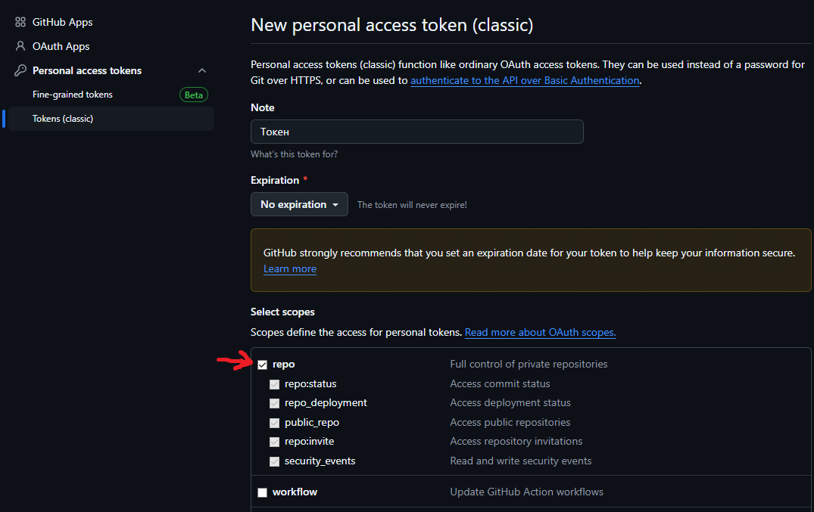

# Как склонировать репу

1. Установи `git`

    - Unix версия: `sudo apt-get install git`
    - [Windows версия](https://git-scm.com/downloads/win)

2. Для пользователей vscode: зайди в аккаунт в левом нижнем углу. Переходи к шагу 7

3. Иначе, зайди в [настройки токенов github](https://github.com/settings/tokens)

4. Выбери "generate new token (classic)"

5. Постави галочку возле "repo/репозиторий"
   

6. Создай и сохрани токен. Его нужно использовать вместо пароля при входе

7. Зайди в папку, в которую собираешься клонировать папку с репозиторием

    > [!TIP] В этой папке будет создана еще одна папка под названием `med-bot`.
    > Тебе не нужно самому создавать папку `med-bot`, она создастся автоматически

8. В консоли, запусти `git clone https://github.com/team-med/med-bot`
