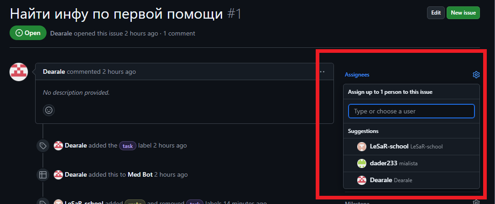
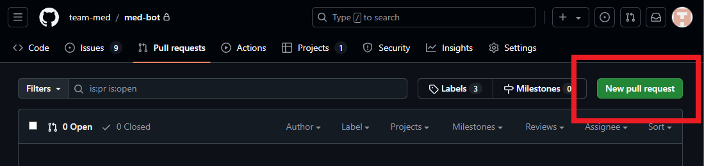

# Процесс разработки

Разрабатываем по принципу _git flow_

Когда появляется новая проблема (issue) на github, и ты хочешь ей заняться, проделай следующие шаги:

-   Добавь себя как "assignee"
    
    Если там уже есть человек, ты опоздал :(
-   Создай ветку с названием `feature/название фичи` от ветви `develop`
    Это можно сделать коммандой `git checkout -b feature/name develop`
-   Пишешь код
-   Когда фича полностью готова, создай `pull request` в github
    
-   Я (Илья) одобрю его или отправлю его на доработку
